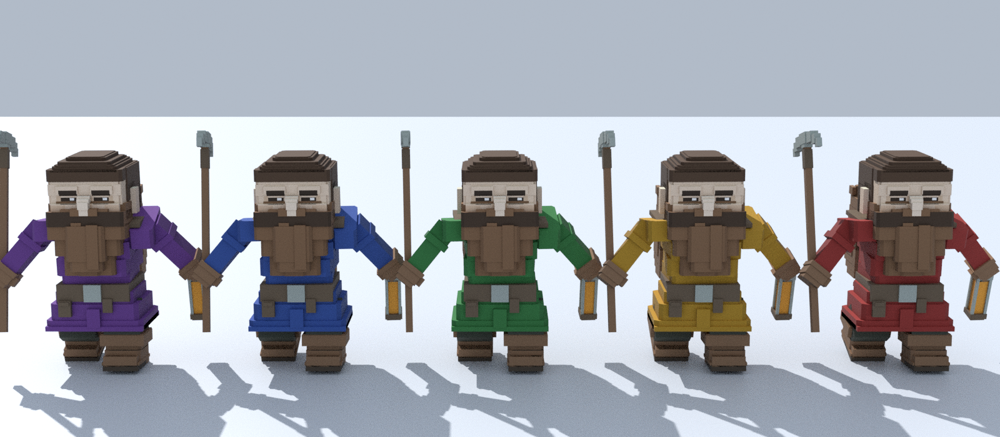

# 12.2 look draft: what you will see (for Wolf's approval before the look is built)

Epic 12 standing AC 7: Wolf approves this before the gui look is built. Made at story creation,
2026-09-29, on `16be274`.

## 1. Per-dwarf colour is the tunic



- **Only the tunic changes.** That covers chest, hips, shoulders and sleeves. Face, beard, hair,
  legs, boots, belt, pick and lantern keep the shipped r17 colours. So every dwarf is still the
  same approved dwarf; only his tunic tells him apart.
- **Mechanism.** The shipped atlas `T_VoxelDwarf_r17` is recoloured per colour id in the client.
  The glTF asset is not touched. Each tunic texel becomes `colour × (texel luminance / brightest
  tunic texel luminance)`, so the shading steps between cells survive.
- **The tunic cells**, measured by a UV→skin-joint census of the shipped GLB (32-px cells,
  `row = floor(v·512/32)`, `col = floor(u·512/32)`, glTF v=0 at the top):
  - row 9, cols 0–3: chest, hips and shoulders;
  - row 10, col 15: chest, hips and shoulders.
  - Row 9, cols 4–8 are the dark legs. They are deliberately left alone.
- **The five colours** (sRGB). Left to right in the image: purple, blue, green, gold, red.

  | id | hex |
  | --- | --- |
  | `red` | `#B23A34` |
  | `gold` | `#D6A42C` |
  | `green` | `#3E924C` |
  | `blue` | `#3C62BA` |
  | `purple` | `#804CA8` |

  There are exactly five, one per dwarf, so any two dwarves differ in hue. The seed decides who
  wears which.
- **Caveat.** This render is Cycles daylight on flat snow. In game the boot hour is 22:00 (moon,
  campfire, torches), and a dwarf is about 11 px tall at the boot distance. Whether the tunics
  read at a glance there is the seat's question, not this image's.

## 2. Names

- **The pool.** Sixteen names from the Völuspá's dwarf list, ASCII only (the tui draws one cell
  per char): Durin, Dvalin, Nori, Ori, Dori, Bifur, Bofur, Gloin, Nain, Thrain, Frar, Loni, Regin,
  Alf, Fjalar, Frosti. The seed picks five distinct names.
- **gui.** When a dwarf is selected (click; Escape releases), one HUD line shows his name in his
  tunic colour, for example `Durin`. Nothing shows with no selection. There are no floating labels
  over heads.
- **tui.** A new roster row above the status row lists all five names, ordered by id, each in his
  tunic colour. The map glyph `☺` keeps its job-state colour, so no existing tui look changes:

  ```
  ██████████████████████████ (map) ██████████████████████████
  Durin  Nori  Bifur  Dvalin  Frosti
  tick 15  normal  z 9/31  dwarves 5  N up
  d dig  c channel  p stockpile  x clear  <> z  hjkl move  q quit client
  ```

## 3. Depth of field (#136)

- **With a dwarf selected:** he stays sharp at every zoom down to the closest (distance 4).
- **With nothing selected** (the rule #136 asks for): DoF keeps focusing the camera's orbit centre,
  which is the point WASD pans and the camp at boot. That is today's behaviour, and every DoF
  guard is calibrated on it.

Reproduce the render: `blender -b --python draft.py -- /abs/out/draft-crew.png`.
