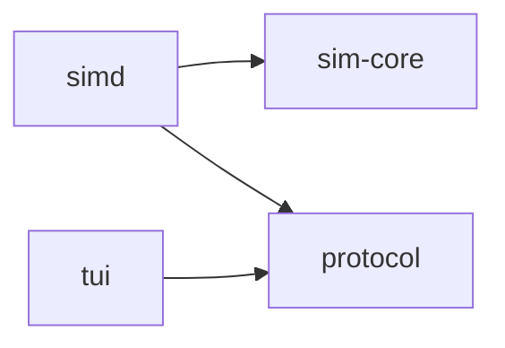
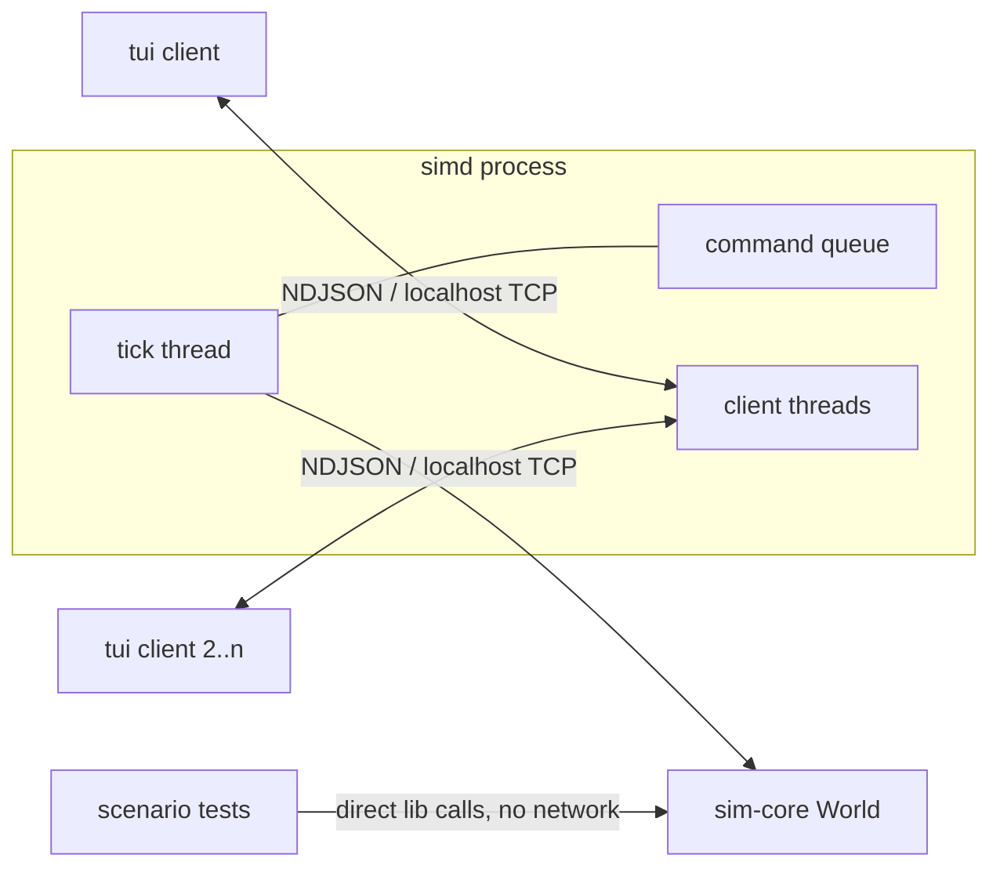

# Architecture Spine — frostvein

## Design Paradigm

**Core–shell (functional core, imperative shells), ECS inside the core.**
`sim-core` is the functional core: a pure, deterministic library (bevy_ecs
headless) with zero I/O — it only ever transforms state via `tick()` and
answers queries. `simd` and `tui` are imperative shells that own all I/O.
`protocol` is the boundary language both shells speak. Clients are pure
renderers of protocol state.

## Invariants & Rules

Dependency direction is a rule — no edge may be added to this graph:



### AD-1 — Sim core is a pure library `[ADOPTED]`

- **Binds:** all
- **Prevents:** game logic leaking into shells; I/O leaking into the sim
- **Rule:** `sim-core` performs no I/O of any kind (no net, no fs, no clock,
  no terminal). `simd` and `tui` contain zero game rules; any rule a client
  needs is exposed by the sim through the protocol.

### AD-2 — Fixed-timestep tick loop, decoupled from clients `[ADOPTED]`

- **Binds:** F6, NFR2
- **Prevents:** frame-coupled simulation; client presence affecting sim state
- **Rule:** `simd` advances the sim at a fixed timestep (default 10 ticks/s)
  regardless of attached clients, and the loop never stops: while paused,
  queued sim commands are still applied and a delta still emitted each
  iteration — only world-advancing systems are skipped, and the tick counter
  freezes. Fast-forward is a loop-rate change. `sim-core` never knows the
  wall-clock rate. (Refines ADR 2's "pause = tick-rate change": sim time
  stops, the daemon does not — so designations placed while paused are
  acknowledged, per NFR2.)

### AD-3 — Protocol v0 is newline-delimited JSON over localhost TCP `[ADOPTED]`

- **Binds:** F7
- **Prevents:** premature protocol optimization
- **Rule:** one JSON object per line: full snapshot on connect, one delta per
  tick, commands upstream. No batching, compression, or interest management
  until the message shapes have stabilized in practice.

### AD-4 — Clients render a world, not a dwarf game `[ADOPTED]`

- **Binds:** F7, F8
- **Prevents:** game vocabulary/rules hardening into the wire format
- **Rule:** messages carry state and typed data (positions, materials,
  professions) — never rules or narrative interpretation. Clients never
  compute game outcomes; they render what the sim reports.

### AD-5 — Plain A* pathfinding `[ADOPTED]`

- **Binds:** F4
- **Prevents:** speculative pathfinding infrastructure
- **Rule:** plain A* on the voxel grid (walk floors, climb ramps/stairs), no
  hierarchy, no caching. Hierarchical pathfinding is a future sim-core-internal
  swap gated on map size, never scaffolded now.

### AD-6 — Wire types live in the `protocol` crate, and only there

- **Binds:** F7, F8, crate graph
- **Prevents:** `simd` and `tui` hand-writing divergent JSON shapes (silent
  desync); `tui` linking the sim
- **Rule:** a fourth crate `protocol` holds serde structs for every wire
  message and nothing else (no logic, no I/O). `simd` and `tui` both depend on
  it; `tui` depends on nothing else in the workspace. No wire shape is ever
  defined outside `protocol`, and closed vocabularies (materials,
  professions, job kinds, speeds, command types) are Rust enums in
  `protocol`, never strings — a `String` field smuggles an unshared
  vocabulary through a shared struct. (Amends technical-preferences.md's
  three-crate layout; that doc is updated to match.)

### AD-7 — Determinism is enforced structurally, not by care

- **Binds:** all of `sim-core` (NFR3)
- **Prevents:** scheduler/iteration/RNG nondeterminism breaking
  seed + commands ⇒ identical state, the contract the scenario harness rests on
- **Rule:** `sim-core` runs a single-threaded, explicitly `.chain()`ed system
  schedule — always the same systems in the same order. Where outcome depends
  on iteration order (job claiming, ties), iterate in stable entity `Id`
  order; no `HashMap`/`HashSet` iteration may affect sim outcomes. All
  randomness derives from the world seed via purpose-named streams (worldgen,
  wander; reaction delay = hash(seed, dwarf id, job id) with a fixed, named
  hash — never `RandomState`) — never ad-hoc RNGs, never wall clock. Parallel scheduling is a future swap gated on a profiled
  problem.

### AD-8 — Deltas: dirty tiles + full resend of everything small

- **Binds:** F6, F7
- **Prevents:** two delta mechanisms; missed-mutation desync; ad-hoc
  per-state-kind diffing
- **Rule:** the tile grid mutates only through `World::set_tile`, which
  records the position in a per-tick dirty set `sim-core` exposes. A delta =
  dirty tiles + ALL small state in full (entities, designations, stockpile
  zones, speed/pause, tick number). Nothing else is ever diffed, and
  full-resend sections are authoritative replacements: the client's set for
  that state kind becomes exactly the list sent — absence is deletion.
  World *construction* (worldgen, `from_save`) does not dirty-track;
  snapshots cover it (AD-11). Chattiness is sanctioned by AD-3.

### AD-9 — Entities have sim-assigned stable ids

- **Binds:** F2, F5, F7, save/load
- **Prevents:** `bevy_ecs` `Entity` handles on the wire (churn across load,
  engine-specific protocol)
- **Rule:** `sim-core` assigns each dwarf/item a `u32` `Id` component from
  ONE global monotonic allocator shared by every entity kind — never
  per-kind counters (dwarf 3 and rock 3 would silently collide in client
  maps, save keys, and AD-7 tie-breaks). Ids are never reused, including
  across load (the allocator's next value is part of `SaveState`). Job ids
  are a separate named space and never appear where an entity id is
  expected. Wire messages and `SaveState` carry only these ids; `Entity`
  never leaves `sim-core`. "Stable id order" in AD-7 means this id.

### AD-10 — Commands enter the sim only at loop boundaries

- **Binds:** F3, F6, F7
- **Prevents:** mid-tick mutation; I/O-order nondeterminism
- **Rule:** only world-mutating commands (`designate`, `cancel_designation`,
  `place_stockpile`) ride the queue: `simd` queues them decoded; `sim-core`
  consumes the queue at the start of the next loop iteration, in arrival
  order. Control commands (`set_speed`, `save`, `load`, `quit`) concern the
  loop, not the world, and are handled by `simd` directly — otherwise
  "resume" could never be processed while paused. No sim state changes
  between iterations. No persistent command log in phase one — determinism is the
  contract, the scenario harness the enforcement. (This queue is also where
  any future input producer — e.g. the LLM sidecar — plugs in; it needs no
  new mechanism. Amends technical-preferences.md ADR 2's "command log"
  wording: the log is a deferred artifact, the determinism property is not;
  that doc is updated to match.)

### AD-11 — Save/load is an explicit `SaveState` struct

- **Binds:** FR16, F9
- **Prevents:** lossy-snapshot saves; bevy reflection machinery
- **Rule:** one plain serde struct in `sim-core` — tick, RNG stream states,
  tiles, entities + components, jobs + claims, designations, zones — via
  `World::to_save()` / `from_save()` — including the entity-id allocator's
  next value (AD-9). `simd` owns the save-file I/O (AD-1
  leaves it nowhere else). `protocol::Snapshot` is a separate, lossy client
  projection and is never used for saving. Load is a wholesale state
  replacement: `simd` broadcasts a fresh `snapshot` to every connected
  client — the one sanctioned bypass of AD-8's dirty set. Clients treat any
  `snapshot` as an authoritative full reset; between snapshots ticks never
  decrease. Scenario test: save → load → tick N ≡ never-saved → tick N.

### AD-12 — One job market

- **Binds:** F2
- **Prevents:** per-job-kind claiming systems double-booking a dwarf ("is
  this dwarf available?" acquiring two owners — deterministic wrong behavior
  the harness would happily reproduce)
- **Rule:** a single job list holds all job kinds as enum variants, with
  monotonic job ids. Exactly one claiming system, at a fixed point in the
  chained schedule, assigns jobs: a dwarf has one `Option<CurrentJob>` and
  is claimable iff it is `None`. FIFO = ascending job id among unclaimed
  jobs; dwarves are considered in ascending entity `Id` (AD-7). Job-kind
  stories add variants and execution systems — never claiming logic.

## Consistency Conventions

| Concern | Convention |
| --- | --- |
| Wire messages | one JSON object per line; `type` field, snake_case values; positions as `[x, y, z]`; ticks u64; entity ids u32 |
| Geometry | z is the vertical axis, 0 = lowest level; rects are inclusive of both corners (`min ≤ max` per axis, single cell = `min == max`) on a single z-level |
| Bulk tile arrays | flat row-major: index = `x + y·dims.x + z·dims.x·dims.y` — ordering is invisible to the type system, so it is fixed here |
| Vocabulary enums | material, profession/job kind are defined in `sim-core` (source of truth), mirrored as serde enums in `protocol`, bridged in `simd` by exhaustive `match` with no wildcard arm — vocabulary drift is a compile error |
| Shared constants | `protocol` exports `DEFAULT_PORT`; neither binary hardcodes its own |
| Color | wire carries material/profession identifiers, never RGB; the id → RGB mapping (24-bit truecolor) is a data table in `tui`, shared by the 2D view and the future raycast view — never hardcoded per draw site |
| Command acknowledgement | no explicit ack messages; a command's effect appearing in the next delta is the acknowledgement (meets NFR2's ~200 ms bar) |
| Malformed client input | `simd` logs and drops the line; the sim never crashes on client input |
| Errors | `thiserror` in `sim-core`/`protocol`, `anyhow` in `simd`/`tui` |
| Constants | hardcoded at use site; promote to a constants module on reuse; to config only when a story needs runtime change |
| State mutation | only `sim-core` systems mutate sim state, only during `tick()`; tiles only via `World::set_tile` (AD-8) |
| Abstraction | no trait/generic/layer with a single implementation (second concrete case first); no config files, plugin systems, event buses, or data-driven content until a third concrete use exists in shipped code |
| Unsafe | `#![forbid(unsafe_code)]` in all four crates |
| TUI drawing | hand-rolled cell framebuffer, flushed once per frame — never per-cell/per-draw-site terminal writes |

## Stack

Verified current on crates.io, 2026-08-01.

| Name | Version |
| --- | --- |
| Rust | stable, edition 2024 |
| bevy_ecs (headless, not full Bevy) | 0.19.0 |
| serde / serde_json | 1.0.229 / 1.0.151 |
| rand / rand_chacha | 0.10.2 / 0.10.0 (rand_chacha needs its `serde` feature for AD-11's RNG-state saves) |
| crossterm | 0.29.0 |
| thiserror / anyhow | 2.0.19 / 1.0.104 |
| Networking | `std::net` + threads (no tokio, no async) |

This list is closed: a new dependency requires one sentence of justification
in its story (technical-preferences.md).

## Structural Seed

```text
frostvein/
  Cargo.toml          # workspace
  crates/
    sim-core/         # world, ECS systems, jobs, A*, SaveState; integration tests = scenario harness
    protocol/         # wire types only (serde structs)
    simd/             # daemon bin: tick loop, TCP server, command queue, delta assembly
    tui/              # client bin: crossterm framebuffer, modal input, color table
```

Runtime topology (phase one, dev-only: WSL2 devpod, localhost TCP, run via
`cargo run`, saves to a local file):



Protocol v0 message list (logical — field detail is owned by the code):

| Direction | Messages |
| --- | --- |
| client → daemon | `designate` (dig \| channel, rect), `cancel_designation` (rect), `place_stockpile` (rect), `set_speed` (pause \| normal \| fast), `save`, `load`, `quit` |
| daemon → client | `snapshot` (on connect and after `load`: dims, tiles, entities, designations, zones, speed, tick), `delta` (per tick, per AD-8) |

## Capability → Architecture Map

| Capability | Lives in | Governed by |
| --- | --- | --- |
| F1 World & terrain gen | `sim-core` | AD-7 (worldgen stream) |
| F2 Dwarves & jobs | `sim-core` systems | AD-7, AD-9, AD-12 |
| F3 Player intents | `protocol` commands → `simd` queue | AD-10 |
| F4 Pathfinding | `sim-core` | AD-5 |
| F5 Items | `sim-core` | AD-9 |
| F6 Daemon & tick loop | `simd` | AD-2, AD-8, AD-10 |
| F7 Protocol v0 | `protocol` (+ `simd` encode/decode) | AD-3, AD-4, AD-6 |
| F8 TUI client | `tui` | AD-4, AD-6, color convention |
| F9 Scenario harness | `sim-core` integration tests | AD-1, AD-7, AD-11 |

The PRD's six `[ASSUMPTION]`s (FR2, FR3, FR4, FR5, FR14, FR23) were all
confirmed as written in the coaching pass, 2026-08-01; AD-7 refines FR5's
delay to `hash(seed, dwarf id, job id)`.

## Deferred

- **Hierarchical pathfinding, chunking, larger maps** — trigger: map size
  with a profiled problem (AD-5).
- **Binary protocol, batching, compression, interest management** — trigger:
  message shapes stabilized *and* a measured problem (AD-3).
- **Protocol generalization (namespaced type vocabulary, per-producer
  commands, schema versioning)** — trigger: the second concrete producer
  exists (Asgard adapter). Recorded in the PRD addendum; nothing scaffolded
  now.
- **LLM whimsy sidecar** — phase 2+; boundary already fixed: outside
  `sim-core`, enters via the AD-10 command queue as ordinary inputs. Its
  replay story requires the persistent command log AD-10 defers — that log
  is part of this trigger's scope, not assumed present.
- **tokio / async** — trigger: a story that concretely needs it.
- **Mouse/touch input** — phase 2, confined to `tui`'s input layer
  (mechanism in the PRD addendum).
- **Raycast 3D view** — its own story late in the milestone; firm phase-one
  scope per Wolf's override, 2026-08-01, superseding FR24's original
  may-slip clause. Creature rendering follows the addendum's decided
  approach: code-authored sub-voxel models sampled during DDA traversal,
  seed-derived individual identity — never sprites or per-creature assets.
- **Parallel ECS scheduling** — trigger: a profiled problem (AD-7).
- **Save-format stability, multi-machine play, Unreal client** — out of
  scope per PRD; nothing in phase one may preclude them, nothing builds for
  them.
- **TUI framework** — trigger: a story shows crossterm alone hurts.
