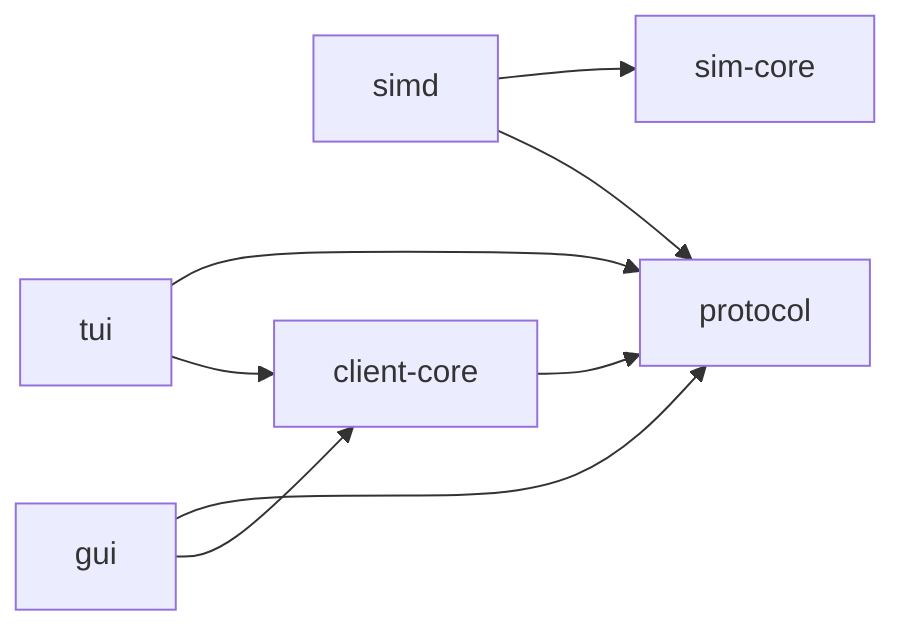
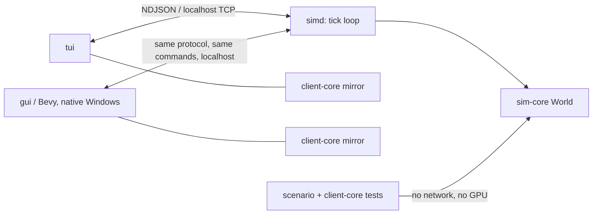

# Architecture Spine — frostvein Milestone 2 (Bevy client)

## Inherited Invariants (parent spine, binding, read-only)

AD-1 through AD-12, all Consistency Conventions, the dependency-graph rule,
and the closed stack of `architecture-frostvein-2026-08-01/ARCHITECTURE-SPINE.md`
bind this milestone. In particular: AD-1 (pure `sim-core`), AD-4 (clients
render a world, never rules), AD-6 (wire types only in `protocol`, enums
never strings), AD-7 (structural determinism), AD-8 (deltas: dirty tiles +
full-resend-as-authoritative-replacement), AD-10 (world-mutating commands via
the queue). No AD below may weaken one of these. Where this spine *extends*
an inherited rule (the dependency graph, one AD-6 sentence), the extension is
explicit here and owed back to the parent — never silent.

**Parent updates owed** (surfaced, not silently contradicted):

- AD-6's sentence "`tui` depends on nothing else in the workspace" is
  **amended by AD-13**: `tui` now also depends on `client-core`. The AD-6
  invariant that matters — no wire shape outside `protocol`, no sim edge in
  clients — is untouched.
- The parent graph's "no edge may be added" enumeration is **superseded by
  this spine's graph**, which becomes the new closed set.
- Stale since the 2026-08-08 pivot: the Deferred entries "Raycast 3D view"
  and "Mouse/touch input — confined to `tui`'s input layer" (picking now
  lives in `gui`; a future touch story would too), the "Unreal client"
  mention, and the Color convention's "shared by … the future raycast view"
  clause (the sharing now happens via `gui`'s light/appearance table
  instead).
- Crate-enumerated parent conventions extend to the new crates:
  `#![forbid(unsafe_code)]` in all **six** crates; `thiserror` in
  `client-core` (library), `anyhow` in `gui` (binary).

## Design Paradigm

**Mirror-then-project clients over the inherited core–shell.** Every client
holds a plain, non-ECS **world mirror** containing wire truth only, owned by
the shared `client-core` crate; rendering *projects* the mirror into its
medium (terminal cells, Bevy render entities) and never touches protocol
decoding. The sim side is unchanged from the parent.

## Invariants & Rules

Dependency direction — this graph supersedes the parent's as the closed set;
no edge may be added to it:



### AD-13 — One client mirror, in `client-core`

- **Binds:** F11, F13, crate graph
- **Prevents:** two implementations of AD-8's client-side semantics
  (absence-is-deletion, snapshot-as-reset) drifting between `tui` and `gui`
- **Rule:** a fifth crate `client-core` (depends on `protocol` only) owns the
  world mirror and ALL snapshot/delta application. Both clients consume it;
  neither reimplements any of it. `tui` adopts `client-core` in an M2 story —
  its current in-crate client state is retired, not kept as a second path.
  That adoption story is load-bearing for this AD and sits on no cut list
  (the PRD's cut order names lanterns and parity, never this). This AD
  amends parent AD-6's "`tui` depends on nothing else" sentence — recorded
  under Parent updates owed.

### AD-14 — Rendering projects the mirror; ingestion never touches the ECS

- **Binds:** F11, F12
- **Prevents:** AD-8 semantics scattered across Bevy ingestion systems;
  render state becoming authoritative
- **Rule:** in `gui`, wire messages mutate only the `client-core` mirror.
  Every render entity is one of exactly two classes: **world-projected**
  (represents mirror state — terrain, dwarves, items, lights, designations,
  zones) or **client-local** (represents nothing on the wire — sky, aurora,
  snowfall, the NFR6 overlay, camera rigs). Bevy reconciliation systems,
  keyed by sim `Id` (AD-9), are the only place world-projected entities are
  created or despawned; deleting every world-projected entity and
  re-projecting must reproduce the same world scene. Client-local entities
  are AD-15's sanctioned atmosphere and never encode world state.

### AD-15 — Interpolation is presentation

- **Binds:** F11; extends NFR5 to time
- **Prevents:** client-side extrapolation/prediction inventing world state
- **Rule:** the mirror holds only states the wire delivered (current tick and
  the previous one, per AD-18's contract). The projection layer may blend
  between those two for smooth motion; it never extrapolates beyond the
  newest tick and never predicts. A `snapshot` (connect or AD-11 load) is a
  world replacement: it clears the previous-tick state, and nothing ever
  blends across it — a rewind snaps, it is not animated. Pure client-side
  atmosphere with no sim meaning (sky, aurora, snowfall, flicker animation,
  dig-face cosmetic chips) is sanctioned by NFR5's carve-out and must never
  acquire sim meaning silently.

### AD-16 — Trees are tiles; everything that glows is an entity with a light field

- **Binds:** F10 (FR27–FR30)
- **Prevents:** the worldgen story and the client story modeling M2 content
  incompatibly; light appearance hardening into the wire
- **Rule:** trees are `Material` variants — exactly two, `TreeTrunk` and
  `TreeFoliage` — occupying voxels (worldgen-seeded, block pathing via
  existing solidity rules, mutate via `set_tile`/AD-8). Digging a tree tile
  removes the tile and drops **no item** (stone comes from mineral
  materials; wood items are deferred) — Wolf's call, 2026-08-09. Snow capping (white tops, bare
  flanks) is presentation, computed by clients from material + exposure —
  never wire state. Every light source is an entity: `kind` names the
  object (`EntityKind` gains `Torch`, `Campfire`), `light: Option<LightKind>`
  names the emission (`LightKind` = `Torch | Campfire | Lantern`); a dwarf
  with a lantern is `light: Some(Lantern)` on a moving entity. Non-dwarf
  entities carry the existing `state` field the way items already do. The
  **sanctioned wire diff for all of M2** is exactly: the `light` field on
  `Entity`, plus the enum variants above — this is what FR30's "vocabulary,
  not shape" means: framing and mechanism (NDJSON, snapshot/delta/command)
  unchanged; these typed additions are the growth. The wire carries kind
  identifiers only — never RGB, radius, or flicker; appearance is a `gui`
  data table keyed by `LightKind`, extending the parent's color-as-data
  convention (AD-4). Vocabulary lands per AD-6: `sim-core` source of truth,
  mirrored serde enums in `protocol`, exhaustive `match` bridges.

### AD-17 — The evidence ladder for a real renderer

- **Binds:** F11–F13, NFR6, the review process
- **Prevents:** "unit-green ≠ feature-proof" collapsing when frames stop
  being byte-comparable; flaky golden-image CI
- **Rule:** world-correctness is proven at rung 1: `client-core` asserted
  headless in CI (byte-exact, same code `gui` renders from), with `tui` as
  the live cross-check on a shared daemon. Rung 2: `gui` logic
  (reconciliation, picking, camera, z-slice) runs headless under minimal
  plugins in `cargo test` — no GPU in CI. Rung 3: visual truth uses `gui`'s
  scripted capture instrument (`--capture`, Bevy screenshot API), which has
  its own tests (file exists, not black, changes when the world changes,
  range-checks what it came to see — exit 0 is not a result) but is **never
  golden-imaged in CI**; captures are the artifact for the PRD sign-off
  gate, and rung 3's judge is Wolf's eye, structurally. Two boundaries:
  captures serve the sign-off gate's **closing** half — the gate's *opening*
  half (Wolf approves a "here is what you will see" artifact before
  implementation) is a PRD process obligation that precedes and is never
  replaced by any capture. And capture self-tests need a real render
  surface, so they are **excluded from `scripts/gate.sh` and default
  `cargo test`** (separately invoked); the gate stays headless.

### AD-18 — `client-core` owns the mirror's contract

- **Binds:** F11–F13, AD-13, AD-15
- **Prevents:** the `tui`-adoption story and the `gui` story each assuming a
  different mirror shape; clients hand-rolling protocol diffs; unbounded
  previous-tick retention
- **Rule:** the mirror's shape is `client-core`'s API, defined there and
  nowhere else: world state keyed by sim `Id`, exposing current tick,
  previous-tick **entity** states (entities only — tiles are never
  double-buffered), and per-tick change information. Providing the previous
  tick is a mandate on `client-core`, not a cap clients may ignore; clients
  consume `client-core`'s change info and never diff wire messages
  themselves. Rect handling is part of this contract: the parent's rect
  rule (single z-level, inclusive corners, `min ≤ max` per axis) is
  **binding for commands**, `client-core` provides the one normalization
  helper both clients use, and `simd` validates incoming rects and
  logs-and-drops violations (the malformed-input convention extended to
  well-formed JSON with invalid semantics).

## Consistency Conventions (M2 additions)

| Concern | Convention |
| --- | --- |
| Light/appearance data | kind → light properties (RGB, radius, flicker) is a data table in `gui`, sibling to `tui`'s color table — never hardcoded per draw site; wire never carries appearance (AD-16) |
| `gui` CLI discipline | mirrors `tui`'s: scripted, deterministic flags (`--capture <path>`, `--frames N`, `--z N`-style pinning as needed); every visual story's instrument is a command line, not a manual recipe |
| NFR6 instrument | frame-time overlay read on screen, not felt: `FrameTimeDiagnosticsPlugin` is a default built-in, but the ready-made `FpsOverlayPlugin` needs the non-default `bevy_dev_tools` cargo feature — enable it or hand-roll the overlay; the story says which |
| Coordinate transform | sim is z-up `[x,y,z]` (parent geometry row); Bevy is Y-up. Exactly ONE transform pair (`world_to_render` / `render_to_world`) lives in `gui`; projection, picking, and capture all call it; a round-trip test pins it. No system does its own axis math |
| Portability | no unix-only code in `gui` or `client-core` (native Windows build is deferred, not precluded) |
| Gate probes | `scripts/gate.sh` probes that `gui` and `client-core` each have no `sim-core` edge (`cargo tree`), siblings of the existing `tui` probe (NFR8) |
| Bevy versioning | `bevy` (workspace `gui`) and `bevy_ecs` (`sim-core`) move together, always the same 0.x line — never two Bevy versions in one workspace |

## Stack (M2 additions)

Verified current on crates.io / bevy.org, 2026-08-09.

| Name | Version | Note |
| --- | --- | --- |
| bevy (full engine) | 0.19.0 | aligns with `sim-core`'s bevy_ecs 0.19.0 (same release train, published 2026-06-19; repo lockfile confirmed); default features + `bevy_dev_tools` if the ready-made FPS overlay is used; trim only on a measured problem. Frame diagnostics and the screenshot API are in default features — no third-party deps |

No other new dependencies at cold start: meshes are built in code
(procedural-first), no voxel crate, no asset pipeline. The parent's closed-list
rule stands: any addition needs one sentence of justification in its story.

## Structural Seed

```text
frostvein/
  crates/
    sim-core/         # + M2: tree materials, light-entity worldgen, lantern field
    protocol/         # + M2: the sanctioned wire diff of AD-16, nothing else
    client-core/      # NEW: world mirror + snapshot/delta application (protocol-only dep)
    simd/             # unchanged structurally
    tui/              # M2 story: adopts client-core, retires in-crate state
    gui/              # NEW: Bevy client — projection, picking, camera, capture instrument
```

Runtime topology (M2). **CORRECTED 2026-08-23 (M2-4).** The original line below said `gui`
displays via WSLg on the devpod; story 5.3 falsified that by measurement — see the NFR6
amendment. `simd` still runs in the WSL2 devpod; **`gui` runs as a native-Windows binary on
gingerspice**, reaching it over localhost. Clients are protocol-only TCP, so the crate graph is
untouched by this.
~~*Superseded:* dev: WSL2 devpod; `gui` displays via WSLg — verified on the dev machine: D3D12
passthrough, RTX 4080 Laptop, Mesa 25.3.5.~~



Sequencing facts this structure creates (epic-planning inputs, alongside the
PRD's first-third-wow counter-metric and cut order): `client-core` exists
before either client consumes it; and the first `gui` story proves the
envelope before anything builds on it — a Bevy window renders at speed
(`glxinfo` proved GL; wgpu prefers Vulkan via WSLg's Dozen driver, confirmed
younger/less conformant — unproven until run, non-negotiable).
**RESOLVED 2026-08-23 (M2-4): the envelope story ran and the answer was NO on this box.**
5.3 walked the ladder to its end and the window opened only on the native-Windows vehicle.
The sequencing fact held and did its job — the envelope was proven before eight stories
built on it; it is the *venue* that moved, not the requirement.

## NFR6 — the measured bar (set here, as the PRD required)

> **AMENDED 2026-08-23 at the Milestone 2 retrospective (Wolf's ruling, action item M2-4).**
> The bar's NUMBERS are unchanged and were met with headroom. **Its MACHINE is corrected:**
> the original text below named the WSLg devpod, and that premise was falsified by measurement
> at story 5.3 — **no devpod can open a window**, on any backend, with stock or self-built
> drivers, and both rungs of the epic's fallback ladder were walked to the end. WSL2 kernel 6.18
> exposes no `/dev/dri`, so Mesa's EGL-X11 path reports `NATIVE_RENDERABLE=FALSE` and wgpu-hal
> refuses a surface below tier 2; the Vulkan rung needed Mesa's Dozen built from source and then
> died on a misreported `DeviceLost` with VRAM measured flat. The remaining lever was forcing
> downlevel limits in `gui` to dodge a non-conformant driver, which story 5.3's own AC9 banned —
> so it was correctly NOT taken.
>
> **The bar is now defined against the vehicle that exists:** `gui.exe` cross-compiled to native
> Windows on **gingerspice** (NVIDIA Vulkan), with `simd` in WSL over localhost — the M2 crate
> graph unchanged, since clients are protocol-only TCP by design.
>
> **Measured against it, all with headroom:** 146 fps at 5.3 (unlit envelope); **140–146 fps
> sustained at 5.4** on the full lit and snowing world (2.3× the 60-fps bar); **>143 fps at 6.1
> at BOTH working zoom and full vista** (~2.4× and ~4.8×).
>
> ~~*Superseded text, kept so the change is legible:* on the WSLg devpod.~~

Sustained **60 fps at working zoom** and **≥30 fps at full vista**, full
128×128×32 world, all dwarves and all lights, **on the live vehicle — gingerspice,
native-Windows `gui.exe`, NVIDIA Vulkan, `simd` in WSL over localhost** — read from
the frame-time overlay.

Client-agnostic restatement of NFR2's ack bar (the change proposal asked for
this in general form): **in any client, a player command's effect is visible
in the issuing client within ~200 ms (one tick + one frame)** — met by the
parent's no-explicit-ack convention unchanged.

## Capability → Architecture Map

| Capability | Lives in | Governed by |
| --- | --- | --- |
| F10 world content (trees, lights) | `sim-core` worldgen + `protocol` vocab, **rendered by both clients** (`tui` glyphs too — the parity rule's backward half) | AD-16, AD-6, AD-7 |
| F11 diorama, light, aliveness | `gui` projection + data tables | AD-14, AD-15, AD-16, AD-18, NFR6 |
| F12 input parity + picking | `gui` → existing protocol commands via the transform pair + rect helper | AD-10 (unchanged), AD-14, AD-18 |
| F13 client lifecycle | `client-core` | AD-13, AD-18, AD-8 |
| Evidence & review | `client-core` tests, `gui --capture` | AD-17 |

PRD `[ASSUMPTION]`s resolved in this pass: sign-off granularity (per visual
story) — confirmed; FR27 density (story-level worldgen tuning) — confirmed;
FR29 (every dwarf carries a lantern, no economy) — confirmed; NFR6's number —
set above.

## Deferred

- **Native Windows build** — trigger: Wolf calls for it (wanted eventually).
  The portability convention keeps it reachable; nothing builds for it now.
- **Asset pipeline (MagicaVoxel `.vox` via bevy_vox_scene)** — trigger: a
  story needs authored assets; dwarves expected first. `bevy_vox_scene` is
  unverified against bevy 0.19 — re-verify at trigger time. The tech-art
  guidelines deliverable is NOT gated on this trigger: its procedural-era
  half (the Visual Target's value discipline, sky-as-illuminant, material
  rules) is owed by the first `gui` visual stories; the asset-contract half
  arrives with the pipeline (PRD).
- **Z-slice control mechanism** — story-level design-and-test (PRD addendum:
  mousewheel/zoom collision). Spine binds only the outcome (FR33).
- **World-edge treatment** — story-level design-and-test (PRD addendum:
  fog/darkness/sky-wrap candidates). Spine binds only the no-raw-edge bar.
- **Vista mountain silhouette** — decide on the record at worldgen tuning
  (PRD addendum; FR2's rolling-hills assumption revisited consciously).
- **Golden-image CI** — trigger: a deterministic, driver-stable render path
  exists; not planned (AD-17 stands without it).
- **Trimming bevy features / build-time work** — trigger: a measured
  gate-time or binary-size problem.
